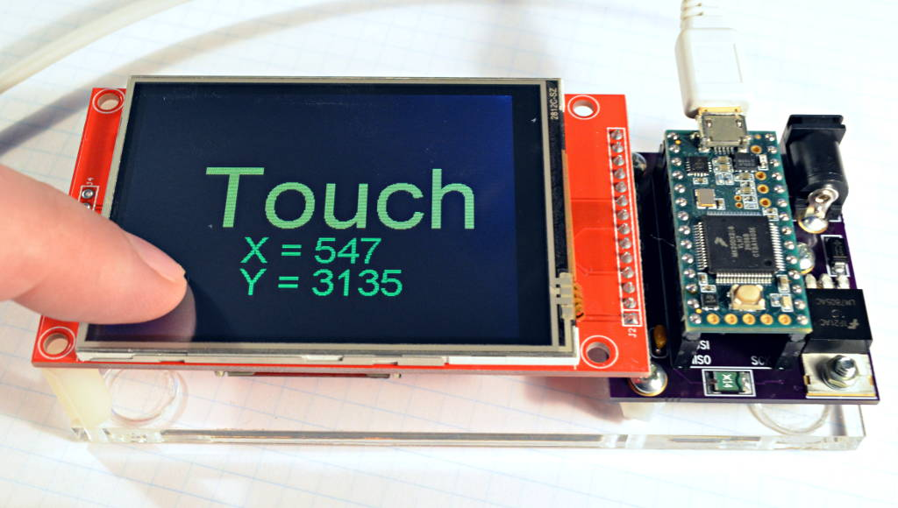

# Teensy 4.1 based Digital Theremin Project

This is an attempt to design good DIY digital [theremin](https://en.wikipedia.org/wiki/Theremin) based on microcontroller.

## Licensing

This is open source open hardware project.

You can freely build device using instructions for personal usage, but cannot sell it.

Firmware is licensed under GPL v2 license.


## Components to buy

### Teensy 4.1 MCU board

Microcontroller board Teensy 4.1 [$26.85 on PJRC.COM](https://www.pjrc.com/store/teensy41.html)


It's pretty suitable microcontroller board for designing of digital theremin. Thanks to Paul Stoffregen.

* ARM Cortex-M7 at 600 MHz (overclocking up to 1GHz)
* Float point math unit, 64 & 32 bits
* 7936K Flash, 1024K RAM (512K tightly coupled), 4K EEPROM (emulated)
* QSPI memory expansion, locations for 2 extra RAM or Flash chips
* USB device 480 Mbit/sec & USB host 480 Mbit/sec
* 55 digital input/output pins, 35 PWM output pins
* 18 analog input pins
* 8 serial, 3 SPI, 3 I2C ports
* 2 I2S/TDM and 1 S/PDIF digital audio port
* 3 CAN Bus (1 with CAN FD)
* 1 SDIO (4 bit) native SD Card port
* 32 general purpose DMA channels
* USB Host 5 Pins with power management	
* SDIO (4 bit data) - Micro SD Socket

Memory can be extended by soldering of additional PSRAM chips (2 x 8MB).

Hardware timer resolution is important for sensitivity of theremin sensor. On teensy, it's working on F_CPU / 4 : 200MHz for 800MHz F_CPU.


For programming, you can use [Teensyduino plugin for Arduino IDE](https://www.pjrc.com/teensy/td_download.html).


### Teensy Audio Board revision D

Teensy 4 Audio (rev D) [$13.75 on PJRC.COM](https://www.pjrc.com/store/teensy3_audio.html)


This is SGTL500 based board.

Supports 16bit 48KHz stereo, with Line In, Line Out, and Phones Out.

Buy revision D (designed for using with Teensy 4.x)


### Color Touch LCD 2.8 inch

Color 320x240 TFT resistive touchscreen [$16 on PJRC.COM](https://www.pjrc.com/store/display_ili9341_touch.html)



TFT board has ILI9341 display controller and XPT2046 resistive touch controller - both accessed via SPI.

Current version display and controls board is designed for using with 2.8 inch screen. There is larger, 3.2 inch display with the same pinout - probably, we will redesign display board for bigger screen.

                                                           
## Sensor

* Designing [theremin sensor](sensors.md)


You can use the [editor on GitHub](https://github.com/teensytheremin/theremin/edit/gh-pages/index.md) to maintain and preview the content for your website in Markdown files.

Whenever you commit to this repository, GitHub Pages will run [Jekyll](https://jekyllrb.com/) to rebuild the pages in your site, from the content in your Markdown files.

### Markdown

Markdown is a lightweight and easy-to-use syntax for styling your writing. It includes conventions for

```markdown
Syntax highlighted code block

# Header 1
## Header 2
### Header 3

- Bulleted
- List

1. Numbered
2. List

**Bold** and _Italic_ and `Code` text

[Link](url) and 
```

For more details see [GitHub Flavored Markdown](https://guides.github.com/features/mastering-markdown/).

### Jekyll Themes

Your Pages site will use the layout and styles from the Jekyll theme you have selected in your [repository settings](https://github.com/teensytheremin/theremin/settings/pages). The name of this theme is saved in the Jekyll `_config.yml` configuration file.

### Support or Contact

Having trouble with Pages? Check out our [documentation](https://docs.github.com/categories/github-pages-basics/) or [contact support](https://support.github.com/contact) and we’ll help you sort it out.
