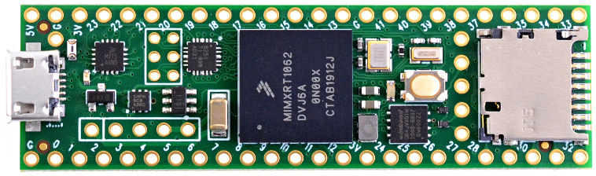

# Teensy Digital Theremin

This project is aimed to design of simple but good DIY digital [theremin](https://en.wikipedia.org/wiki/Theremin) based on microcontroller and FPGAs.

Teensy 4.1 and Teensy Audio Adaptor boards are responsible for audio synthesis.
Android tablet is used for as controlling UI.
Two small and cheap FPGA boards implement digital part of theremin sensors.
Reference design uses laser cut acrylic or plywood cabinet and 10mm water pipes and fittings as antennas (close to Moog Etherwave form factor).

This project is currently in progress.

* [Github page](https://github.com/teensytheremin/theremin)
* [Forum thread](http://thereminworld.com/Forums/T/32640/teensy-40-600mhz-arm-cortex-m-7-mcu---ideal-for-digital-mcu-based-theremin) on thereminworld.com

## Licensing

This is open source open hardware project.

You can freely build device using instructions for personal usage, but cannot sell it.

Firmware is licensed under GPL v2 license.

## Hardware

### Components to buy

#### Teensy 4.1 MCU board

Microcontroller board Teensy 4.1 [$26.85 on PJRC.COM](https://www.pjrc.com/store/teensy41.html)

It's pretty suitable microcontroller board for designing of digital theremin. Thanks to Paul Stoffregen.

* ARM Cortex-M7 at 600 MHz (overclocking up to 1GHz)
* Float point math unit, 64 & 32 bits
* 7936K Flash, 1024K RAM (512K tightly coupled), 4K EEPROM (emulated)
* QSPI memory expansion, locations for 2 extra RAM or Flash chips
* USB device 480 Mbit/sec & USB host 480 Mbit/sec
* 55 digital input/output pins, 35 PWM output pins
* 18 analog input pins
* 8 serial, 3 SPI, 3 I2C ports
* 2 I2S/TDM and 1 S/PDIF digital audio port
* 3 CAN Bus (1 with CAN FD)
* 1 SDIO (4 bit) native SD Card port
* 32 general purpose DMA channels
* USB Host 5 Pins with power management	
* SDIO (4 bit data) - Micro SD Socket

Memory can be extended by soldering of additional PSRAM chips (2 x 8MB).

Hardware timer resolution is important for sensitivity of theremin sensor. On teensy, it's working on F_CPU / 4 : 200MHz for 800MHz F_CPU.

For programming, you can use [Teensyduino plugin for Arduino IDE](https://www.pjrc.com/teensy/td_download.html).

#### Teensy Audio Board revision D

Teensy 4 Audio (rev D) [$13.75 on PJRC.COM](https://www.pjrc.com/store/teensy3_audio.html)

This is SGTL500 based board.

Supports 16bit 48KHz stereo, with Line In, Line Out, and Phones Out.

Buy revision D (designed for using with Teensy 4.x)

#### 2 x Lichee Tang Nano FPGA Boards

Two small FPGA boards are used for implementing of digital part of sensors.
One FPGA for Volume sensor, one for Pitch sensor.

[Sipeed Lichee Tang Nano](https://tangnano.sipeed.com/en/) is available on [aliexpress.com](aliexpress.com) for about $6

FPGAs implement digital phase locked loop (DPLL), with main hum noise filtering, and provides its output to MCU via I2S data stream.

                                                           
### Sensor

* Designing [theremin sensor](sensors.md)

