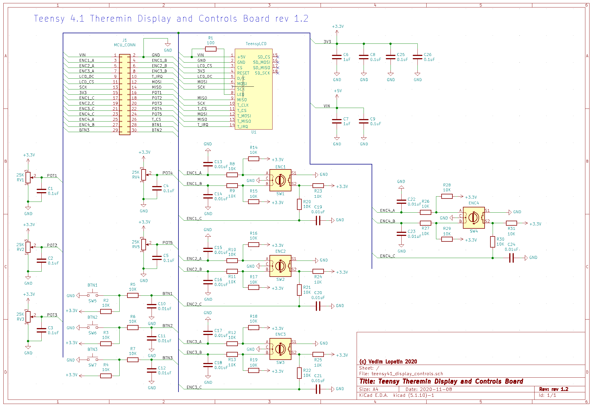

# Display and controls board

Display and controls board has resistive touch LCD and a few encoders, pots, and buttons.

Connected to main board using IDC connector.

* ([KiCAD project](https://github.com/teensytheremin/theremin/tree/main/schematics/kicad/teensy41_display_controls))

* ([schematics pdf](pdfs/teensy41_display_controls.pdf))

* ([PCB Gerber files](https://github.com/teensytheremin/theremin/raw/main/schematics/kicad/teensy41_display_controls/gerber/teensy41_display_controls/teensy41_display_controls.zip))

## Bill of materials

TODO

