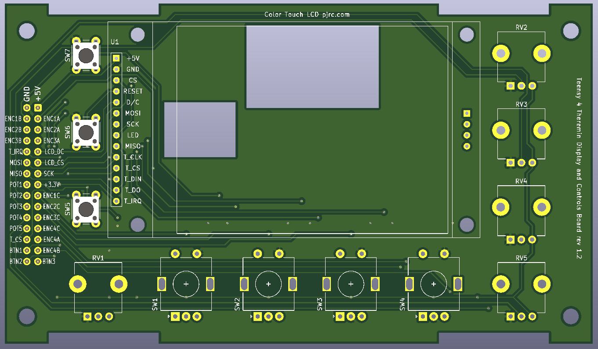
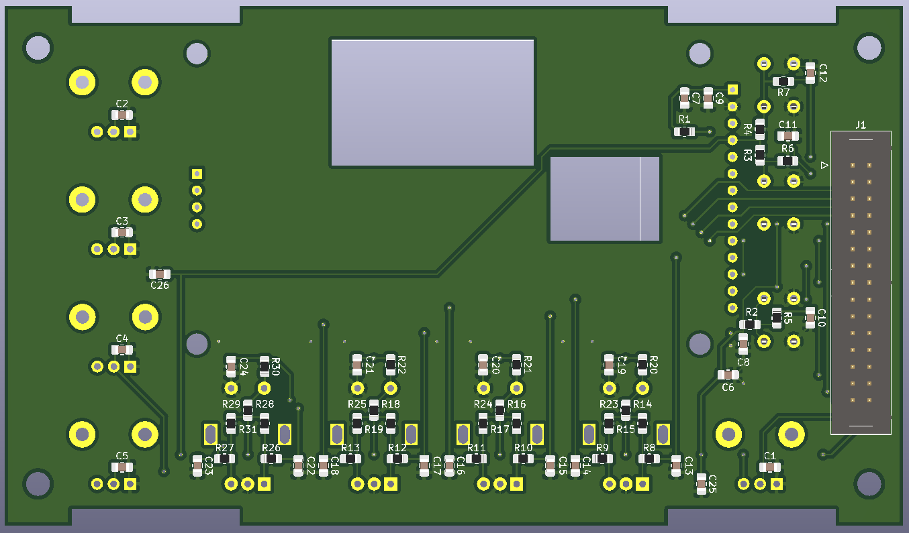

# Display and controls board

Display and controls board has resistive touch LCD, 4 encoders, 5 pitentiometers, and 3 buttons.

Connected to main board using 30-pin IDC connector.

2.8 inch display is soldered directly to this PCB using pin header

* [KiCAD project](https://github.com/teensytheremin/theremin/tree/main/schematics/kicad/teensy41_display_controls)

* [schematics pdf](pdfs/teensy41_display_controls.pdf)

* [PCB Gerber files](https://github.com/teensytheremin/theremin/raw/main/schematics/kicad/teensy41_display_controls/gerber/teensy41_display_controls/teensy41_display_controls.zip)

## Bill of materials

| Component | Count | Description |
| --------- | ----- | ----------- |
| IDC-30 vertical | 1 | Interfacing with main board |
| EC11 encoder | 4 | Incremental encoder with button |
| Potentiometer linear 10K or 20K | 5 | Pots |
| Tact button | 3 |  |

TODO

