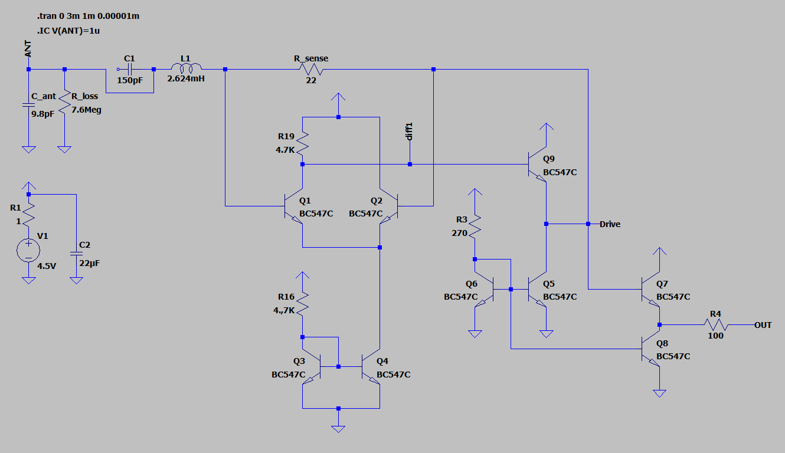
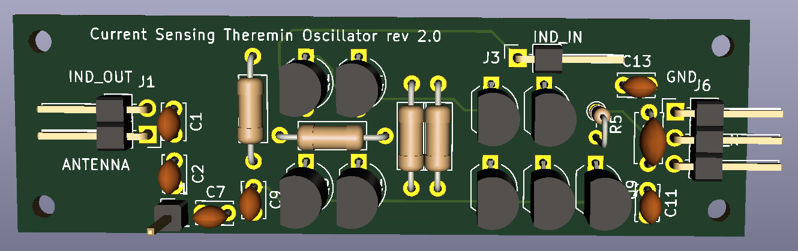
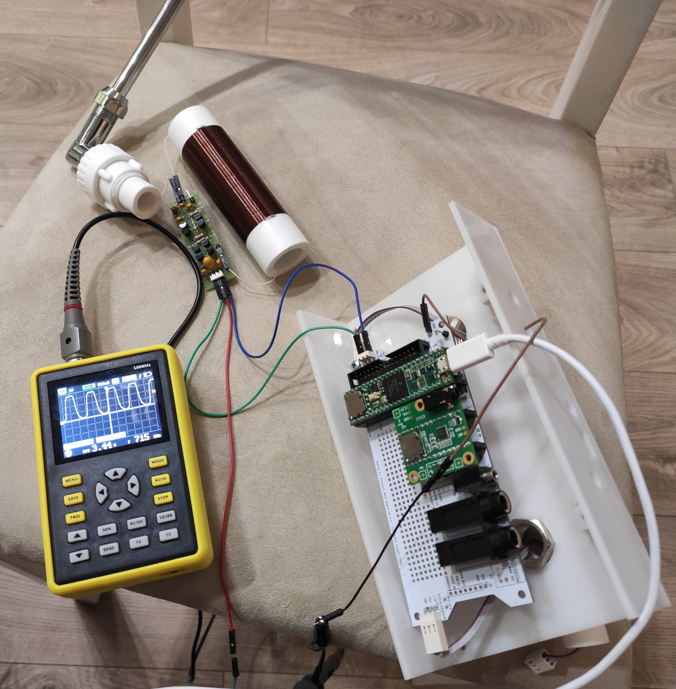
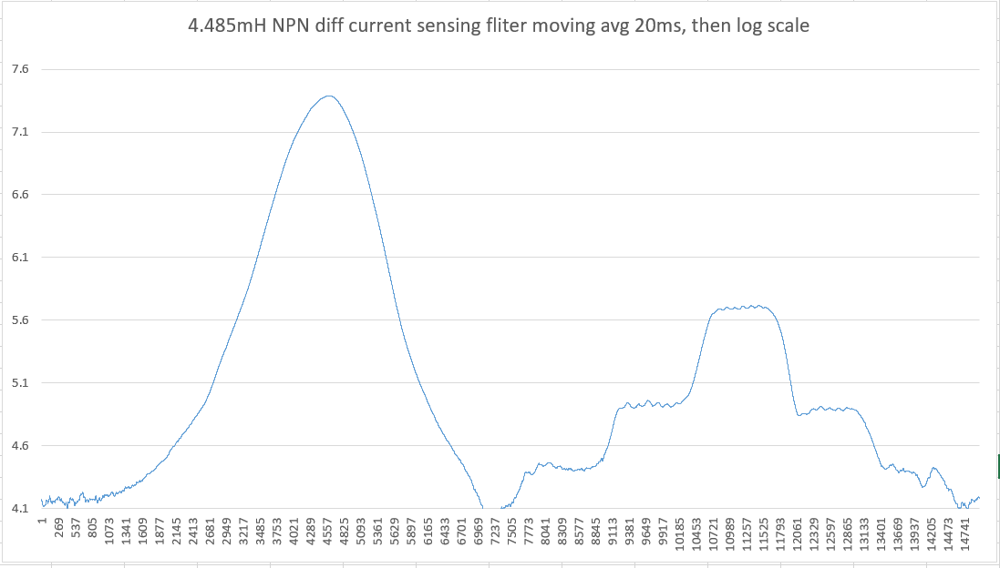
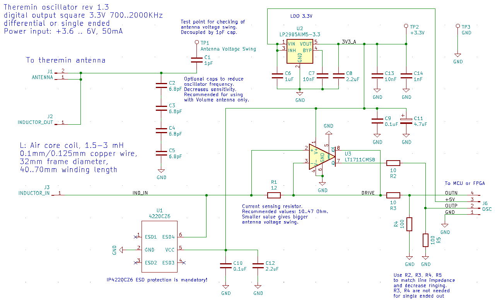
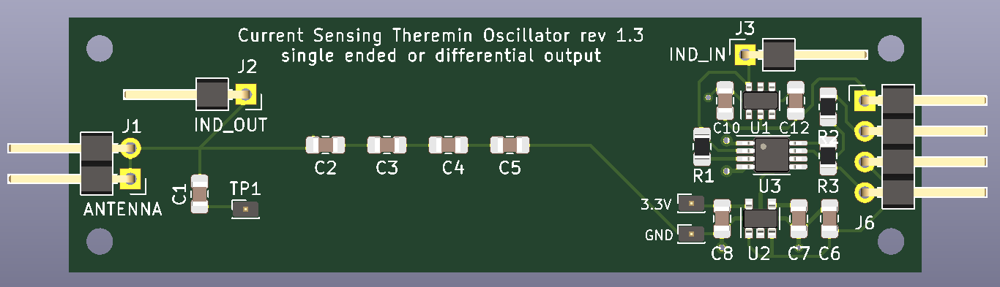
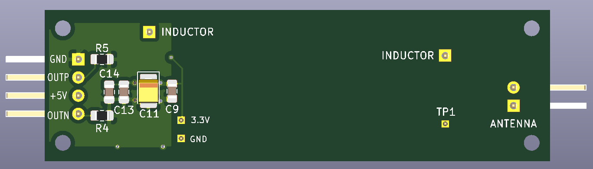
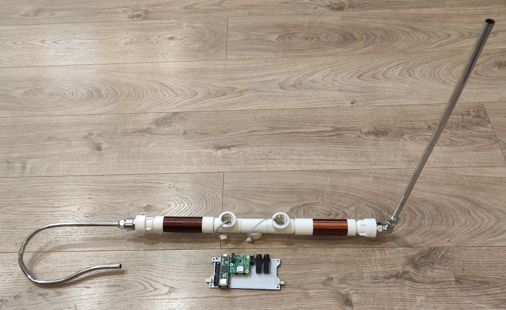
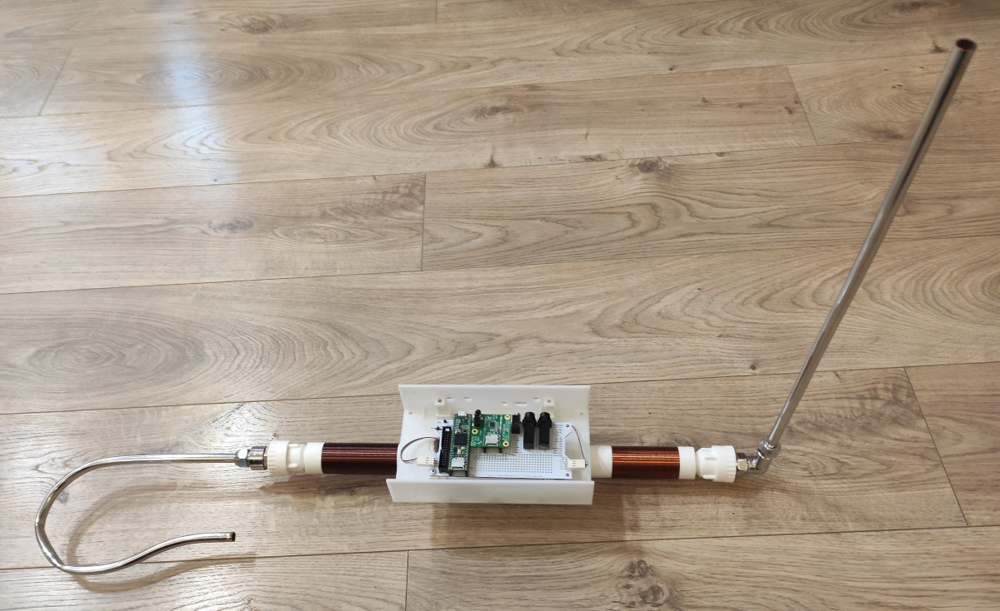

# Sensors

In theremin sensor, we need to measure antenna capacitance with high precision, and fast enough.

Typical antenna capacitance is 8..10pF if there is no hand near antenna.

When hand is close to antenna, it adds 1.5 .. 2 pF to antenna C.

While hand is moved from antenna, each 10cm of distance reduces C introduced by hand by 3.5 times.

Total antenna C varies only by 15..20% for different hand distances.

To measure C we can use RC delay or LC tank resonance. For RC, measured value is proportional to C, while for LC - to sqrt(C). In absolute values, this leads to 20% of measured value changes for RC approach, and 8% for LC.
Although at first sight, RC looks more sensitive (output value is changed two times more than one from LC), in practice RC sensor can be used for toys with short working hand to antenna distance.

Antenna in theremin receives a lot of RF noise. With RC approach, voltage swing on antenna is limited by power supply voltage. With high Q LC tank, voltage on antenna exceeds power supply voltage by 10..200 times.
Noise received by antenna has the same level for both RC and LC, but voltage swing is much higher for LC, so signal to noise ratio is 10-100 times better just due to bigger voltage swing.
As well, LC tank filters out all frequencies outside its resonance band.

With LC approach, there are two possible methods to measure C in LC. We can either make LC oscillator and measure its frequency, or pass some drive signal with frequency close to LC resonance and measure phase shift between drive signal and LC current or voltage.
For Teensy Theremin, we will use LC osillator as sensor analog front end.

Teensy Theremin has two 3-pin connector (GND, +5V, OUT) for interfacing with theremin antenna sensors.

Output signal from sensor is supposed to be 3.3V square wave with duty cycle close to 50%.

Typical frequency of sensor output is 500KHz..2MHz.

Sensor signal frequency will be reduced by 5..7% when hand approaches antenna.

Almost any LC oscillator can be used with Teensy Theremin, while it meets signal requirements.

It's a good idea to simulate sensor schematic in LTSpice before building it.

## Classic LC oscillators

Usually, theremins use some of classic LC oscillator schematic: [Clapp](https://en.wikipedia.org/wiki/Clapp_oscillator), [Colpitts](https://en.wikipedia.org/wiki/Colpitts_oscillator), [Hartley](https://en.wikipedia.org/wiki/Clapp_oscillator).

## Current Sensing oscillators

Idea of current sensing LC oscillator has been proposed by Eric Wallin (aka dewster) on thereminworld forum (see [topic](http://thereminworld.com/Forums/T/33275/armstrong-hartley-colpitts-clapp-wallin)).

When LC tank is excitated with drive signal of frequency near LC resonance, drive current phase matches drive voltage. It's possible to measure current LC tank consumes from drive, and use it as drive signal.

Simple method of current measure is putting series R between drive and inductor, and measure voltage shift on this resistor.

Advantages:

* The only C in LC for current sensing approach is antenna capacitance - bigger relative sensitivity
* Oscillator can be connected to inductor and antenna via one wire - from driving side
* High antenna swing voltage is achievable (up to 500..1000Vpp with high Q low R inductor).

### BJT differential amplifier current sensing oscillator

Eric's oscillator LTSpice model:

Recent BJT based differential amplifier current sensing oscillator is available in [this post](http://thereminworld.com/forums/T/30562?post=221201#221201)

LTSpice model ([download link](https://github.com/teensytheremin/theremin/raw/main/schematics/ltspice/dewster_diff_osc_8xistor_2021-08-24.asc)):

### BJT differential amplifier current sensing

### LT1711 comparator based oscillator

Simple current sensing oscillator with minimum components.

                                                                                                                                                        	
KiCAD schematics:

[download PDF](pdfs/current_sensing_single_ended_oscillator.pdf)

[download PDF rev 1.3](pdfs/current_sensing_single_ended_oscillator_compact.pdf)

PCB Render:

Testing of soldered LT1711 oscillator:

According to test results, R_sense should be increased from 22 Ohm to 33 or 47.

Working pretty well except one issue: when hand is touching uninsulated antenna, oscillator switches to very high frequency (5-10MHz instead of working 1MHz) - and does not return to normal oparation even if hand is removed.

### LTC6752 based oscillator

Another comparator based current sensing oscillator.

Trying to design schematic which allows to experiment with different additional components. The goal is to workaround touch issue found during LT1711 oscillator testing.

LTSpice model ([download link](https://github.com/teensytheremin/theremin/raw/main/schematics/ltspice/2021_comparator_ltc6752_current_sensing_01.asc)):

                                                                                                                                                    	